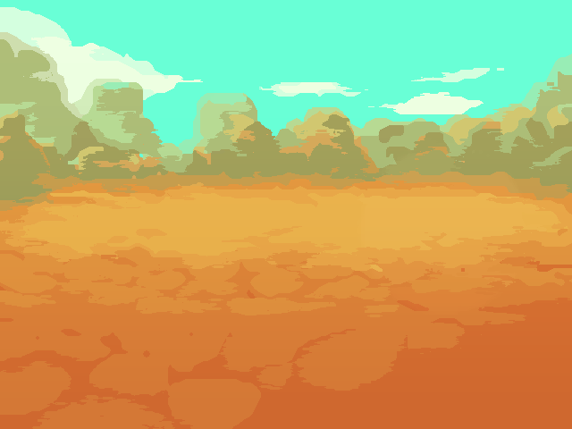

# Of Warrior And Monsters

---

A traditional turn based RPG inspired by the Sonny Series. This is a hobby project and is hence has neither a timeline nor a fixed release date as of now.

### Table of Contents

- [Of Warrior And Monsters](#of-warrior-and-monsters)
    - [Table of Contents](#table-of-contents)
  - [Game Details](#game-details)
    - [Plot](#plot)
    - [Characters](#characters)
    - [Monsters](#monsters)
    - [Areas](#areas)
  - [Technical Details](#technical-details)
    - [Technologies Used](#technologies-used)
    - [Platforms targeted](#platforms-targeted)
  - [Credits](#credits)



## Game Details

### Plot

### Characters

### Monsters

### Areas

## Technical Details

### Technologies Used

Of Warriors and Mosters is being built using several state-of-the-art technologies.

- Raylib : The game is developed using Raylib.
- Inky
- Piskel

### Platforms targeted

Of Warriors And Monsters is targeted to be released in two phases:

- The first phase will target Desktop stores including Steam, GoG.com and Itch.io
- The Second Phase will begin after a while during which the game will be released on Mobile Stores, mainly targeting Android.

## Credits

This project was possible due to :

- Lorem
- Ipsum
- Dolor
- Sit
- Amet

```\n
More details to follow soon 
```
